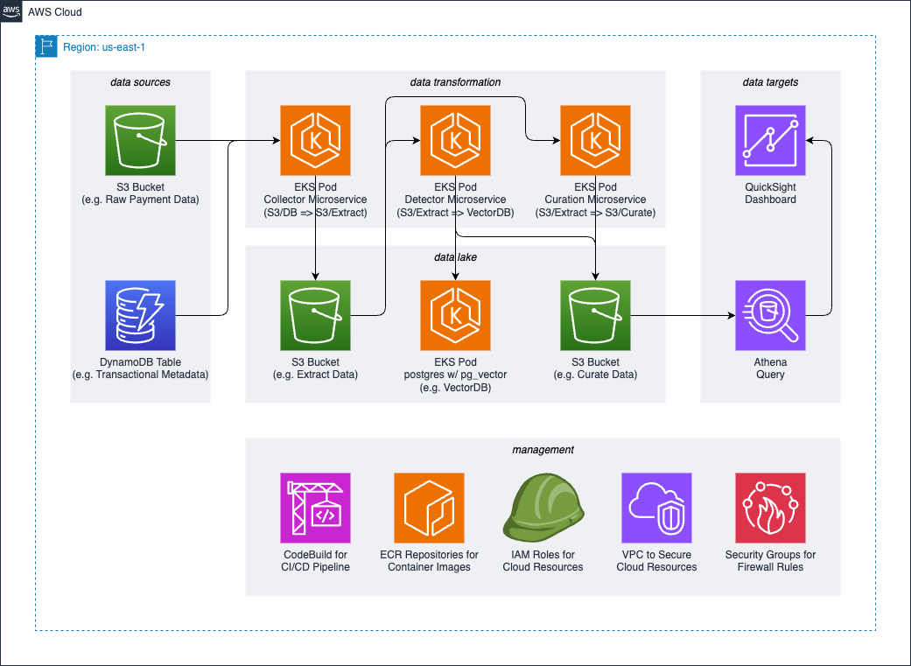

# Safeguarding Payments

Safeguarding Payments: Fraud Detection, AI/ML and Data Insights

Leveraging AI and data analytics to build an intelligent fraud detection system
that safeguards payments and provides financial institutions with actionable
insights to stop fraudulent transactions.

## Architecture Diagram



## Getting Started

This solution is designed to be flexible and robust with modular code stored
across the following directories:

1. `iac/` - Infrastructure as Code
    * `iac/cicd/` - CI/CD Pipeline Module
    * `iac/core/` - Core Infrastructure Module
    * `iac/quicksight/` - QuickSight Infrastructure Module
2. `app/` - Application Code
    * `app/data-collector/` - Data Collector Microservice (Java-based Module)
    * `app/fraud/` - Fraud Detector Microservice (Python-based Module)
    * `app/postgres/` - PostgreSQL Database

### Pre-requisites

* an [AWS account](https://docs.aws.amazon.com/accounts/latest/reference/manage-acct-creating.html)
* already installed [AWS CLI](https://docs.aws.amazon.com/cli/latest/userguide/getting-started-install.html),
[JQ](https://jqlang.github.io/jq/download/), [Kubectl](https://docs.aws.amazon.com/eks/latest/userguide/install-kubectl.html),
[Terraform](https://developer.hashicorp.com/terraform/tutorials/aws-get-started/install-cli), and
[Terragrunt](https://terragrunt.gruntwork.io/docs/getting-started/install/)
* [AWS access keys](https://docs.aws.amazon.com/accounts/latest/reference/credentials-access-keys-best-practices.html)
used by AWS CLI
* allowed AWS CLI permissions to create
[AWS Identity and Access Management (IAM) roles](https://docs.aws.amazon.com/IAM/latest/UserGuide/id_roles_create.html)
and [AWS CodeBuild project](https://docs.aws.amazon.com/codebuild/latest/userguide/planning.html) (e.g.,
[IAMFullAccess](https://docs.aws.amazon.com/aws-managed-policy/latest/reference/IAMFullAccess.html) and
[AWSCodeBuildAdminAccess](https://docs.aws.amazon.com/aws-managed-policy/latest/reference/AWSCodeBuildAdminAccess.html))
* an [Amazon Simple Storage Service (S3) bucket](https://docs.aws.amazon.com/AmazonS3/latest/userguide/create-bucket-overview.html)
used by Terraform remote state (e.g. *spf-backend-us-east-1*)

### Deploy CI/CD Module

Starting at the ROOT level of this repository, run the following command:

```sh
/bin/bash ./bin/deploy.sh -d iac/cicd -r us-east-1 -t spf-backend-us-east-1
```

> REMINDER: Make sure to replace *us-east-1* with your target AWS region and
*spf-backend-us-east-1* with your S3 bucket.

Once the build execution is successful, you should be able to login to AWS
Management Console, navigate to AWS CodeBuild service and see the newly created
project named something like *spf-cicd-pipeline-abcd1234*.

The suffix *abcd1234* in your AWS CodeBuild project name is the solution
deployment ID. This value can be used to test this solution, once deployed
successfully.

### Deploy Core Module

Using CI/CD pipeline created in the previous step, run the following commands:

```sh
aws codebuild list-projects --region us-east-1 \
    --query 'projects[?contains(@, `spf-cicd-pipeline`) == `true`]'
```

> REMINDER: Make sure to replace *us-east-1* with your target AWS region.

The output from the previous command should be used as the `project-name` input
in the next command (just replace *spf-cicd-pipeline-abcd1234* with new value):

```sh
aws codebuild start-build --region us-east-1 \
    --project-name spf-cicd-pipeline-abcd1234
```

> REMINDER: Make sure to replace *us-east-1* with your target AWS region and
*spf-cicd-pipeline-abcd1234* with the value from the previous command.

### Deploy Any Module

The CI/CD pipeline can be used to deploy any module (including itself, although
not recommended). The order of operations for entire solution deployment is:

1. In previous steps we deployed `iac/cicd` (CI/CD module) and `iac/core`
(Core module)
2. After done with `iac/cicd` and `iac/core`, deploy any other Infrastructure
modules from `iac/` directory (e.g. `iac/quicksight`)
3. After done with Infrastructure modules, deploy any dependencies required by
Application modules from `app/` directory (e.g. `app/postgres`)
4. After done with Application dependencies, deploy any other Application
modules from `app/` directory (e.g. `app/data-collector` or `app/fraud`)

To pick which module to deploy (e.g. `app/postgres`), simply pass the
directory relative path value to `SPF_DIR` environment variable as shown below:

```sh
aws codebuild start-build --region us-east-1 \
    --project-name spf-cicd-pipeline-abcd1234 \
    --environment-variables-override "name=SPF_DIR,value=app/postgres"
```

## Cleaning Up

If you decide to clean up your AWS environment and remove all AWS resources
deployed by this solution, this can be easily achieved by running the following
two commands:

```sh
/bin/bash ./bin/deploy.sh -c true -d iac/core -r us-east-1 -t spf-backend-us-east-1
```

```sh
/bin/bash ./bin/deploy.sh -c true -d iac/cicd -r us-east-1 -t spf-backend-us-east-1
```

> REMINDER: Make sure to replace *us-east-1* with your target AWS region and
*spf-backend-us-east-1* with your S3 bucket.

## Support

*Tell people where they can go to for help. It can be any combination of an
issue tracker, a chat room, an email address, etc.*

## Roadmap

*If you have ideas for releases in the future, it is a good idea to list them
in the README.*

## Authors and acknowledgment

*Show your appreciation to those who have contributed to the project.*

## Contributing

See the [CONTRIBUTING](./CONTRIBUTING.md) for more information.

## Security

See the
[Security Issue Notifications](./CONTRIBUTING.md#security-issue-notifications)
for more information.

## License

This library is licensed under the MIT-0 License. See the [LICENSE](./LICENSE)
for more information.
